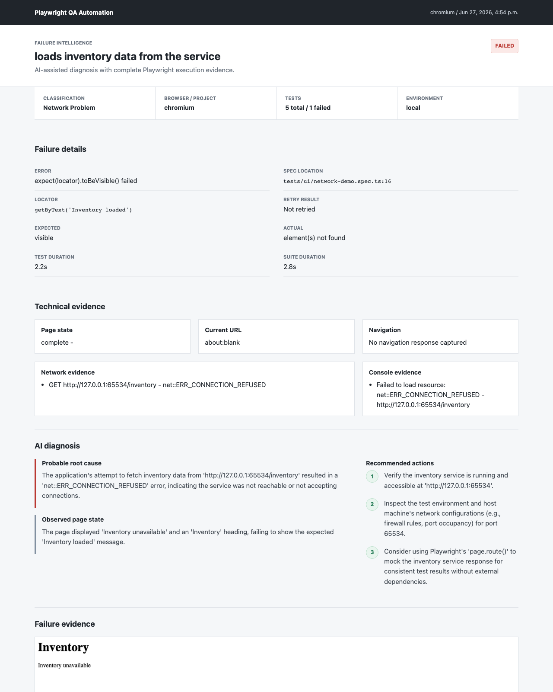

# Playwright E2E Automation Framework with AI-assisted QA

End-to-end QA automation framework built with Playwright and TypeScript. The project demonstrates a maintainable UI test architecture using Page Object Model, test data separation, tagged test execution, and failure diagnostics through Playwright reports, screenshots, videos, and traces.

## Table of Contents

- [Tech Stack](#tech-stack)
- [Current Coverage](#current-coverage)
- [Project Structure](#project-structure)
- [Installation](#installation)
- [Running Tests](#running-tests)
- [Test Strategy](#test-strategy)
- [Diagnostics](#diagnostics)
- [AI-assisted Failure Analysis](#ai-assisted-failure-analysis)
  - [Report Example](#report-example)
  - [Report Field Reference](#report-field-reference)
  - [Failure Classifications](#failure-classifications)
- [Roadmap](#roadmap)
- [License](#license)

## Tech Stack

- Playwright Test
- TypeScript
- Node.js 20+
- Page Object Model
- HTML test reports
- Trace, screenshot, and video artifacts

## Current Coverage

The current UI suite uses https://www.saucedemo.com/ as the test application and covers:

- Successful login
- Invalid login error validation
- Add product to cart
- Remove product from cart
- Complete checkout flow

The Lace Up API suite covers:

- Public backend health status
- Unauthenticated access control
- Local E2E Session creation
- Authenticated run-list access

## Project Structure

```text
data/
  users.ts                 Test users and checkout data

fixtures/
  test.ts                  Shared test fixture and technical evidence capture

pages/
  LoginPage.ts             Login page actions and assertions
  InventoryPage.ts         Product listing and cart entry actions
  CartPage.ts              Cart assertions and checkout entry
  CheckoutPage.ts          Checkout information and order completion

tests/
  ui/
    login.spec.ts          Login smoke and negative tests
    cart.spec.ts           Cart workflow tests
    checkout.spec.ts       End-to-end checkout regression test
  laceup/
    auth.setup.ts          Local E2E Session setup
    api/
      runs.spec.ts         Public, permission, and authenticated API tests

config/
  ai-failure-analysis-prompt.md
                           Customizable Gemini analysis instructions

scripts/
  analyze-failure.mjs      Structured AI analysis and HTML report generation

docs/images/
  ai-failure-report-example.png
                           README report example

playwright.config.ts       Playwright runtime configuration
tsconfig.json              TypeScript project configuration
```

## Installation

```bash
npm install
npx playwright install chromium
```

## Running Tests

Run the full suite:

```bash
npm test
```

Run UI tests:

```bash
npm run test:ui
```

### Lace Up API Tests

Start the Lace Up backend with local E2E authentication:

```bash
cd /path/to/lace_up
docker compose -f compose.dev.yaml -f compose.e2e.yaml up -d db backend
```

Run the API suite from this repository:

```bash
npm run test:api
```

The suite verifies the public health endpoint, unauthorized access control, and authenticated access to the runs API. Authentication state is written to the ignored `playwright/.auth/` directory and must never be committed.

Run smoke tests:

```bash
npm run test:smoke
```

Run regression tests:

```bash
npm run test:regression
```

Run tests in headed mode:

```bash
npm run test:headed
```

Open the HTML report:

```bash
npm run report
```

## Test Strategy

This project separates test intent from page implementation details:

- Specs describe business behavior.
- Page objects own selectors, actions, and page-level assertions.
- Test data is isolated under `data/`.
- Tags such as `@smoke` and `@regression` support targeted execution.
- Failure artifacts help with debugging without adding noise to passing runs.

## Diagnostics

The Playwright configuration currently enables:

- HTML report generation
- Screenshot capture on failure
- Video retention on failure
- Trace collection on first retry
- CI-only retries
- CI protection against committed `test.only`

## AI-assisted Failure Analysis

This project includes an optional Gemini-powered failure analysis script. Playwright remains responsible for deterministic pass/fail validation; AI is used only after failures to classify and summarize Playwright error details, technical evidence, page state, and recent screenshots.

Create a local `.env` file based on `.env.example`:

```env
GEMINI_API_KEY=your_gemini_api_key_here
GEMINI_MODEL=gemini-2.5-flash
AI_SCREENSHOT_LIMIT=1
TEST_ENV=local
```

Run the analyzer after a failed Playwright test:

```bash
npm run ai:analyze-failure
```

The report is written to:

```text
ai-report/failure-analysis.html
```

The AI prompt template can be customized in:

```text
config/ai-failure-analysis-prompt.md
```

### Report Example

The example below shows a failed inventory request classified as a `Network Problem` after Playwright captured `ERR_CONNECTION_REFUSED` evidence.



### Report Field Reference

#### Header and Run Summary

| Field | Description |
| --- | --- |
| Failure Intelligence | Identifies the page as an AI-assisted failure triage report. |
| Test title | The Playwright test name taken from the JSON reporter. |
| Status | The final test status. This report is generated for failed executions, so the value is `FAILED`. |
| Browser / Project | The Playwright project that executed the test, such as `chromium`. |
| Run time | The start date and time recorded by the Playwright JSON reporter. |
| Classification | A human-readable AI classification used to route the failure to the likely owner. |
| Tests | Total and failed test counts for the complete Playwright suite execution. |
| Environment | The target environment from `TEST_ENV`; defaults to `local` when it is not set. |

#### Failure Details

| Field | Description |
| --- | --- |
| Error | The primary Playwright assertion or runtime error. |
| Spec location | The failing spec file and exact source line. |
| Locator | The Playwright locator involved in the failure when one is available. |
| Retry result | Indicates whether the test was retried and whether the retry passed or failed. |
| Expected | The expected assertion result reported by Playwright. |
| Actual | The received value or observed failure, such as `element(s) not found`. |
| Test duration | Execution time of the failed test result. |
| Suite duration | Total duration of the complete Playwright run. |

#### Technical Evidence

| Field | Description |
| --- | --- |
| Page state | The final `document.readyState` and page title captured after failure. |
| Current URL | The final page URL with credentials, query parameters, and fragments removed. |
| Navigation | The latest document navigation URL and HTTP status when available. |
| Network evidence | Failed requests and HTTP 4xx/5xx responses, including method, sanitized URL, status, or transport error. |
| Console evidence | Redacted browser console errors captured during the failed test. |

Technical evidence is collected by `fixtures/test.ts`. Sensitive URL components and common credential-like console values are removed before the evidence is written or sent for analysis.

#### AI Diagnosis

| Field | Description |
| --- | --- |
| Probable root cause | The most likely cause inferred from the supplied evidence. It is intentionally labeled probable because AI analysis is not proof of root cause. |
| Observed page state | A concise description of only the UI state visible in the supplied screenshot and page evidence. |
| Recommended actions | Up to three concrete debugging steps. These are suggestions and must be validated by an engineer. |

#### Failure Evidence

| Field | Description |
| --- | --- |
| Failure screenshot | The most recent configured failure screenshot, embedded directly in the HTML report. The screenshot filename is intentionally hidden. |
| Reproduction command | A focused Playwright CLI command for rerunning the failed test and project. |

#### Complete Playwright Report

| Field | Description |
| --- | --- |
| Result summary | Passed, failed, flaky, and skipped counts from the complete suite run. |
| Embedded report | The standard Playwright HTML report containing every test, execution step, error, screenshot, video, and available trace for the run. |
| Open full report | Opens the standard Playwright report in a separate browser tab. |

### Failure Classifications

The report keeps stable internal values for automation and displays readable labels for people:

| Internal value | Display label | Meaning |
| --- | --- | --- |
| `TEST_CODE` | Test Code Error | Incorrect locator, assertion, synchronization, or test implementation. |
| `APPLICATION` | Application Problem | Product UI, backend, or browser runtime behavior appears defective. |
| `TEST_DATA` | Test Data Problem | Credentials, fixtures, account state, or required data are invalid or unavailable. |
| `ENVIRONMENT` | Environment Problem | Browser startup, dependency, configuration, or execution infrastructure failed. |
| `NETWORK` | Network Problem | DNS, timeout, TLS, connection refusal, offline access, or another transport failure directly blocked the tested behavior. |
| `FLAKY` | Flaky Test | The failure is intermittent or passes on retry without a deterministic product change. |

An element-not-found error alone is not classified as a network problem. `NETWORK` requires causal request-failure evidence.

## Roadmap

Planned improvements:

- GitHub Actions workflow for CI execution
- Cross-browser and mobile projects
- AI-assisted trace summarization
- README badges and published test report artifacts

## License

MIT
